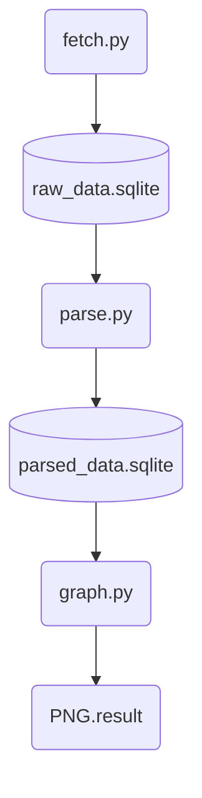

# NASA EONET Data Pipeline & Analytics

## Video Demo:
[Click here!](https://www.youtube.com/watch?v=vCGIdU1Tm2U)

## Overview
- Developed a Python-based data pipeline that retrieves and processes NASA EONET event data, stores raw and processed datasets in SQLite, performs geospatial analysis using GeoPandas, and generates statistical visualisasion for each event

## Description:
NASA EONET Data Pipeline & Analytics is a three stage ETL (Extract => Transform => Load) pipeline that fetches, cleans, and visualises global natural disaster event data (and some man-made disaster) from NASA's Earth Observatory Natural Event Tracker (EONET) API.
The pipeline is split into three independent, each of which reads from and writes data to its own SQL database:

- `fetch.py`: Streams event data from EONET v3 API with resilient error handling:
  exponential backoff for rate limits (429/503) and network instability, connection reuse
  via persistent sessions, and memory-efficient JSON streaming via ijson to handle up to 10,000
  events without loading the full response into memory. Stores raw, deduplicated data into SQLite

- `parse.py`: Cleans and restructures raw event data, including a geopandas spatial join  against
   EEZ/land boundary shapefiles to resolve each event's geographic coordinates to a sovereign territory (with explicit handling for [Antarctic Treaty](https://2009-2017.state.gov/t/avc/trty/193967.htm) boundaries and open-ocean events).

- `graph.py`: Generates dual-scale (linear/log) ranking charts by country and category, plus monthly trend visualisations (individual and trellis/small multiples layouts) across all disaster categories, with CLI arguments for filtering by custom date range.

### Design Decisions & Trade-off

#### Why autoincrementing ID instead of event_id as the PRIMARY KEY?
- Early in development, `event_id` was used directly as the PRIMARY KEY  for coordinate data. This seemed reasonable since each event has its own `event_id` — But it siliently broke on multi point events. A single events like cyclone can have dozens of entries tracking its path over time, and using `event_id` as primary key meant only the last point for each event ever got stored; ever earlier point was overwritten. This was discovered by manually inspecting a real multi-point cyclone event ([EONET_12376](https://modis.gsfc.nasa.gov/gallery/individual.php?db_date=2025-01-14)) and comparing its expected geometry count against what actually made it into database. The fix was switching to an autoincrementing `id` column with composite `UNIQUE(event_id, lon, lat)` constraint instead.

#### Why unmatched coordinate fall back to Antarctica and high seas instead of being dropped
- EEZ/land boundary only have coordinates from an existing sovereign states. It will ignore coordinate that is not belonging to them. Such as Antarctica and high seas.

#### Why use geospatial join over a simple loop
- A simple loop would work, but it cost longer time to load events. Implementing geospatial reduces the time for the program to finish it.

#### Why Trellis (small multiples) chart instead of one shared axis line chart ?
  - During progress, a one shared axis line chart graph causes some category to be  overlapped by other, more dominant category. Most of the category flattened into a nearly invisible line near zero. Rather than force all categories onto a shared scale (which would misrepresent the smaller categories) or manually pick different scales per category (which would misrepresent relative frequency), the trellis layout gives each category its own subplot with its own y-axis, letting each category's actual trend shape be visible on its own terms while still allowing visual comparison of shape across categories side by side.

#### Why both linear and log scale bar charts?
- Country and category ranking are heavily skewed data, but it depends on what data the user wants to see. Some of data might look already neat but most of them isn't. With the implementation of both linear and log scale, the project avoid any misleading information for the user.

#### Why CLI and standard user input in `graph.py`?
- CLI offer flexibility and faster respond compared to standard user input, it is designed specifically for user who knows how to use it. Whereas, standard user input works as an alternative if user does not know how to use CLI

#### Other
- It may depends on what data and internet connection you have to process. But for the best time it took less than ~20s for the three programs to finished completely

## Features

- Handles user input, query parameters, database operations, and common runtime errors while maintaining high efficiency

- Warns users if they fetch fewer than 10,000 events for a year or fewer than 1000 events for a month, as the data might get truncated

- Uses spatial joins to process the dataset in batches before storing the parsed data in another database for maximum efficiency

- Converts the data into a bar charts (show total counts) and a line chart (show changes over time) 

- Bar charts are shown in both Linear scale (Actual data) and Log scale (Balanced data) to better handle heavily skewed data

## Project Workflow


## Technologies used

### Core & Database
- **Python 3.14.5** - Programming Language
- **SQLite 3.46.1** - Lightweight database for storing raw and processed data
### Data Processing & Analytics
- **Pandas 3.0.3** - Data manipulation and analysis
- **GeoPandas 1.1.3** - Geospatial data analysis (spatial joins)
- **ijson 3.5.0** - Iterative JSON parser for memory efficiency
- **Requests 2.34.2** - Sending HTTP requests to the NASA EONET API
### Data Visualization
- **Matplotlib 3.11.0** - Creating bars and lines graph visualizations

### GIS Assets
- **EEZ_land_union v4** - Land and sea boundary dataset for coordinate mapping (point-to-polygon)
### Python Built-in Libraries
- **json** - Parsing small-scale JSON data and converting Python objects into JSON string
- **time & datetime** - Managing request delays and time formats
- **logging** - Error handling and system debugging

## Installation

### Prerequisites

Before running this project, install the following software:

- Python 3.11 or later
- Git (optional, for cloning the repository)
- DB Browser for SQLite (optional, for viewing the databases)

### Install Python Dependencies

```bash
pip install requests ijson geopandas pandas matplotlib
```

The EEZ Land Union dataset is already included in this repository and requires no additional installation

## Usage
The project consist of three connected programs:

### fetch.py 
- Fetches natural event data from NASA EONET API and stores it in `raw_data.sqlite`

```bash
python3 fetch.py
```

### parse.py
- Processes and normalizes raw data, performs reverse geospatial mapping, and stores the results in `parsed_data.sqlite`

```bash
python3 parse.py
```

### graph.py
- Reads processed data from `parsed_data.sqlite` and generates the analyzed visualization in `result_graph` folder

```bash
python3 graph.py
```

## Results Overview
 - **Country Ranking**
 >

 - **Category Ranking**
 >

 - **Event Over Time**

    > - **Trellis Graph**
    >>
    > - **Separate Line Graph**
    >>
    >>
    >>
    >>

## Current Limitation

- NASA EONET does not publish an official API rate limit. This project limits requests to 10,000 events per query to avoid straining the server

- Uses only the EEZ_land_union dataset, which is less accurate compared than geospatial API

- Spatial accuracy is limited to the point-to-polygon method, which only determines whether a coordinate belongs to a territory

- Results may be affected by data imbalance because NASA EONET provides coordinates based only on observation points

- Polygons centroids are manually calculated using the average of polygon points, making the implementation hardcoded 
